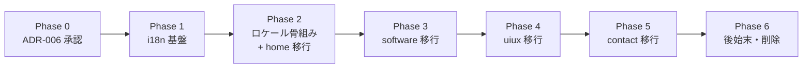

# フロントエンドアーキテクチャ再設計 計画

**作成日**: 2026-07-11
**目的**: FSD から Next.js App Router 流儀への再設計を、段階的かつ安全に実行するための作業計画とゴールを定義する。

---

## 位置づけ

本ドキュメントは「どう直すか（実行計画）」と「ゴール像」を扱う作業計画である。決定の背景・代替案・意思決定の正規ソースは [ADR-006](../adr/ADR-006-nextjs-idiomatic-architecture.md) とし、本書からはリンクで参照する。

---

## ゴール

### 一言で

規模に合わない FSD の重厚なレイヤリングを廃し、Next.js App Router の流儀（ルート近接コロケーション、Server Component 既定、ロケールルーティング）に沿った構造へ移行する。あわせて、現状の構造的欠陥（依存方向違反・i18n 破綻・コンテンツ SSOT 分裂）を解消する。

### ゴール状態のディレクトリ構造

```text
src/
├── app/
│   ├── [lang]/                 # /en /ja ロケールルーティング
│   │   ├── layout.tsx          # ルート layout（<html lang> + generateStaticParams）
│   │   ├── page.tsx            # home
│   │   ├── contact/page.tsx
│   │   ├── software/
│   │   │   ├── page.tsx
│   │   │   ├── [slug]/page.tsx  # ecommerce / jma-systems / techdoctor を集約
│   │   │   └── _components/     # software ルート専用（コロケーション）
│   │   └── uiux/
│   │       ├── page.tsx
│   │       ├── [slug]/page.tsx  # achievy / six-acres を集約
│   │       └── _components/
│   ├── globals.css
│   └── page.tsx                # / → /en へのリダイレクト
├── components/                 # 横断再利用 UI（原則 Server Component）
│   └── language-switcher.tsx   # 数少ない 'use client'
├── content/                    # コンテンツの単一ソース（型付き）
│   ├── software/
│   ├── uiux/
│   └── dictionaries/           # en / ja の UI 文言
├── lib/                        # i18n / フォーマッタ / データローダ
└── types/                      # 横断型（原則は各所コロケーション）
```

### Before / After 対応

| 現状（FSD） | ゴール（Next.js 流儀） |
| ----------- | ---------------------- |
| `features/*/ui/` | ルート配下 `_components/` または `components/` |
| `features/*/model/` | Server Component 化で大半廃止。必要な状態のみ `'use client'` の葉に |
| `features/*/data/` | `content/`（型付きコンテンツ） |
| `features/*/types/` | 各所コロケーション or `types/` |
| `shared/utils/` | `lib/` |
| `shared/ui/` | `components/` |
| `shared/hooks/useLanguage` | ロケールルーティング + `lib/i18n` |
| `src/data/` + ルート `resume.yml` | `content/` に統一（SSOT） |
| `software/{ecommerce,...}/page.tsx` ×3 | `software/[slug]/page.tsx` ×1 |

---

## 解消する既存課題

詳細と根拠は [ADR-006](../adr/ADR-006-nextjs-idiomatic-architecture.md) を参照。要点のみ:

| 課題 | 内容 |
| ---- | ---- |
| 依存方向違反 | `shared/utils/uiuxUtils.ts` が `@/features/uiux/data` を import（逆流） |
| i18n 破綻 | `useLanguage` がローカル state のみで言語切替が伝播しない |
| SSOT 分裂 | 履歴書コンテンツが `resume.yml` / `src/data/resume.yaml` / `features/*/data` の3系統 |
| 過剰レイヤリング | 静的サイトに4層 × feature。`return null` の空コンポーネント等のデッドコード |
| RSC 未活用 | 全ページ `'use client'` |

---

## 進め方の原則

- **段階移行**: ルート単位で PR を分割し、各 PR で `mise run lint` / `type-check` / `build` を通す。
- **挙動保持と仕様変更を分離**: 移設・再配置は `refactor`、i18n ルーティングと SSOT 統一は `feat`/`fix` としてコミット・PR を分ける。
- **見た目の不変を確認**: リファクタ PR では移行前後で表示が変わらないことを確認する。
- **旧構造は最後に削除**: 移行完了まで旧 `features`/`shared` を残し、参照が消えた段階でまとめて削除する。

---

## フェーズ計画



| Phase | 内容 | 主な成果物 | 種別 |
| ----- | ---- | ---------- | ---- |
| 0 | 再設計の意思決定 | ADR-006 | docs |
| 1 | i18n 基盤（ルーティング非依存） | `lib/i18n.ts`、`content/dictionaries/{en,ja}.ts` | feat |
| 2 | ロケール骨組み + home 移行 | `app/[lang]/layout.tsx`（`generateStaticParams`）、`app/page.tsx`（`/`→`/en`）、home の移設 | feat + refactor |
| 3 | software 移行 | `software/[slug]` 集約、`_components/` コロケーション | refactor |
| 4 | uiux 移行 | `uiux/[slug]` 集約、`_components/` コロケーション | refactor |
| 5 | contact 移行 | contact ルート移設 | refactor |
| 6 | 後始末 | `features`/`shared`/`src/data` 削除、CLAUDE.md・architecture.md 更新 | refactor + docs |

---

## 技術的な要点

- **静的書き出しとの両立**: `output: 'export'` では middleware が使えない。ロケール判定は `[lang]` セグメントと、ルート layout の `generateStaticParams` が `en`/`ja` を返す方式で静的生成する。
- **ルート layout は1つ**: `<html lang>` を持てるのは最上位 layout のみ。したがってロケール導入時は全ルートを `[lang]` 配下へ移す必要がある（Phase 2 以降）。
- **`/` のリダイレクト**: middleware 不可のため、`app/page.tsx` でデフォルトロケール `/en` へ遷移させる。
- **Server Component 既定**: `'use client'` は言語切替などインタラクティブな葉のみに限定する。

---

## 完了の定義（Done）

- [ ] `src/features/` と `src/shared/` が存在しない
- [ ] `shared → features` のような逆流 import が存在しない
- [ ] 言語切替が全ページで正しく伝播する（`/en` `/ja` で静的生成される）
- [ ] コンテンツの正規ソースが `content/` に一本化されている（`resume.yml` の重複が解消）
- [ ] `return null` 等のデッドコンポーネント・空バレルが削除されている
- [ ] `software` / `uiux` の個別ルートが `[slug]` に集約されている
- [ ] `mise run lint` / `type-check` / `build` が通る
- [ ] CLAUDE.md・architecture.md がゴール構造に更新されている

---

## 関連

- [ADR-006](../adr/ADR-006-nextjs-idiomatic-architecture.md): 再設計の意思決定（正規ソース）
- [ADR-002](../adr/ADR-002-feature-based-layered-architecture.md): 置き換え対象の旧アーキテクチャ
- [architecture.md](./architecture.md): システムコンテキスト（Phase 6 で更新）
