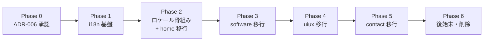

# フロントエンドアーキテクチャ再設計 計画

**作成日**: 2026-07-11
**目的**: FSD から Next.js App Router 流儀への再設計を、段階的かつ安全に実行するための作業計画とゴールを定義する。

---

## 位置づけ

本ドキュメントは「どう直すか（実行計画）」と「ゴール像」を扱う作業計画である。決定の背景・代替案・意思決定の正規ソースは [ADR-006](../adr/ADR-006-nextjs-idiomatic-architecture.md) とし、本書からはリンクで参照する。

---

## ゴール

### 一言で

規模に合わない FSD の重厚なレイヤリングを廃し、Next.js App Router の流儀（ルート近接コロケーション、Server Component 既定、ロケールルーティング）に沿った構造へ移行する。あわせて、現状の構造的欠陥（依存方向違反・i18n 破綻・コンテンツ SSOT 分裂）を解消する。

### ゴール状態のディレクトリ構造

```text
src/
├── app/
│   ├── [lang]/                 # /en /ja ロケールルーティング
│   │   ├── layout.tsx          # ルート layout（<html lang> + generateStaticParams）
│   │   ├── page.tsx            # home
│   │   ├── contact/page.tsx
│   │   ├── software/
│   │   │   ├── page.tsx
│   │   │   ├── [slug]/page.tsx  # ecommerce / jma-systems / techdoctor を集約
│   │   │   └── _components/     # software ルート専用（コロケーション）
│   │   └── uiux/
│   │       ├── page.tsx
│   │       ├── [slug]/page.tsx  # achievy / six-acres を集約
│   │       └── _components/
│   ├── globals.css
│   └── page.tsx                # / → /en へのリダイレクト
├── components/                 # 横断再利用 UI（原則 Server Component）
│   └── language-switcher.tsx   # 数少ない 'use client'
├── content/                    # コンテンツの単一ソース（型付き）
│   ├── software/
│   ├── uiux/
│   └── dictionaries/           # en / ja の UI 文言
├── lib/                        # i18n / フォーマッタ / データローダ
└── types/                      # 横断型（原則は各所コロケーション）
```

### Before / After 対応

| 現状（FSD） | ゴール（Next.js 流儀） |
| ----------- | ---------------------- |
| `features/*/ui/` | ルート配下 `_components/` または `components/` |
| `features/*/model/` | Server Component 化で大半廃止。必要な状態のみ `'use client'` の葉に |
| `features/*/data/` | `content/`（型付きコンテンツ） |
| `features/*/types/` | 各所コロケーション or `types/` |
| `shared/utils/` | `lib/` |
| `shared/ui/` | `components/` |
| `shared/hooks/useLanguage` | ロケールルーティング + `lib/i18n` |
| `src/data/` + ルート `resume.yml` | `content/` に統一（SSOT） |
| `software/{ecommerce,...}/page.tsx` ×3 | `software/[slug]/page.tsx` ×1 |

---

## 解消する既存課題

詳細と根拠は [ADR-006](../adr/ADR-006-nextjs-idiomatic-architecture.md) を参照。要点のみ:

| 課題 | 内容 |
| ---- | ---- |
| 依存方向違反 | `shared/utils/uiuxUtils.ts` が `@/features/uiux/data` を import（逆流） |
| i18n 破綻 | `useLanguage` がローカル state のみで言語切替が伝播しない |
| SSOT 分裂 | 履歴書コンテンツが `resume.yml` / `src/data/resume.yaml` / `features/*/data` の3系統 |
| 過剰レイヤリング | 静的サイトに4層 × feature。`return null` の空コンポーネント等のデッドコード |
| RSC 未活用 | 全ページ `'use client'` |

---

## 進め方の原則

- **段階移行**: ルート単位で PR を分割し、各 PR で `mise run lint` / `type-check` / `build` を通す。
- **挙動保持と仕様変更を分離**: 移設・再配置は `refactor`、i18n ルーティングと SSOT 統一は `feat`/`fix` としてコミット・PR を分ける。
- **見た目の不変を確認**: リファクタ PR では移行前後で表示が変わらないことを確認する。
- **旧構造は最後に削除**: 移行完了まで旧 `features`/`shared` を残し、参照が消えた段階でまとめて削除する。

---

## フェーズ計画



| Phase | 内容 | 主な成果物 | 種別 |
| ----- | ---- | ---------- | ---- |
| 0 | 再設計の意思決定 | ADR-006 | docs |
| 1 | i18n 基盤（ルーティング非依存） | `lib/i18n.ts`、`content/dictionaries/{en,ja}.ts` | feat |
| 2 | ロケール骨組み + home 移行 | `app/[lang]/layout.tsx`（`generateStaticParams`）、`app/page.tsx`（`/`→`/en`）、home の移設 | feat + refactor |
| 3 | software 移行 | `software/[slug]` 集約、`_components/` コロケーション | refactor |
| 4 | uiux 移行 | `uiux/[slug]` 集約、`_components/` コロケーション | refactor |
| 5 | contact 移行 | contact ルート移設 | refactor |
| 6 | 後始末 | `features`/`shared`/`src/data` 削除、CLAUDE.md・architecture.md 更新 | refactor + docs |

---

## 技術的な要点

- **静的書き出しとの両立**: `output: 'export'` では middleware が使えない。ロケール判定は `[lang]` セグメントと、ルート layout の `generateStaticParams` が `en`/`ja` を返す方式で静的生成する。
- **ルート layout は1つ**: `<html lang>` を持てるのは最上位 layout のみ。したがってロケール導入時は全ルートを `[lang]` 配下へ移す必要がある（Phase 2 以降）。
- **`/` のリダイレクト**: middleware 不可のため、`app/page.tsx` でデフォルトロケール `/en` へ遷移させる。
- **Server Component 既定**: `'use client'` は言語切替などインタラクティブな葉のみに限定する。

---

## ページ別移行タスク

各ルートについて「現状の構成」「ゴールの構成」「ロジックの扱い」を対応付け、チェック可能なタスクに分解する。ファイル名はゴール構造では kebab-case（Next.js 慣習）に統一する。

### home（`/` → `/[lang]`）

| 現状 | ゴール |
| ---- | ------ |
| `app/page.tsx`（`'use client'` 相当・`useHomePage`） | `app/[lang]/page.tsx`（Server Component） |
| `features/home/ui/Home*Section.tsx` | `app/[lang]/_components/*.tsx` |
| `features/home/model/useHomePage.ts`（マウス視差・mounted・isLoaded） | 視差のみ client の葉 `_components/hero-parallax.tsx` に分離。`isLoaded`/`mounted` は RSC 化で廃止 |
| `features/home/data/homeData.ts` | `content/home.ts` |
| `features/home/ui/HomeStyles.tsx`（`return null`） | 削除 |

- [ ] `homeData.ts` を `content/home.ts` へ移設（型付き・言語別）
- [ ] Home セクション群を `app/[lang]/_components/` へ移設し Server Component 化
- [ ] マウス視差ロジックのみ `'use client'` の葉に切り出す
- [ ] `useHomePage` と `HomeStyles` を削除、`useLanguage` を `lang` param に置換

### software 一覧（`/software` → `/[lang]/software`）

| 現状 | ゴール |
| ---- | ------ |
| `app/software/page.tsx`（`useSoftwarePage`） | `app/[lang]/software/page.tsx`（Server Component） |
| `features/software/ui/*`（Hero/CoreExpertise/Experience/Featured/KeyAchievements/Skills/Contact/MatrixBackground） | `app/[lang]/software/_components/*` |
| `useSoftwarePage`（`showAllExperience` トグル・isLoaded） | トグルは `ExperienceSection` を client の葉に。isLoaded は廃止 |
| `features/software/data/softwareData.ts` | `content/software/index.ts` |
| `features/software/ui/SoftwareStyles.tsx`（`return null`） | 削除 |

- [ ] `softwareData.ts` を `content/software/index.ts` へ移設
- [ ] セクション群を `_components/` へ移設・Server Component 化
- [ ] `showAllExperience` を持つ部分のみ client の葉に切り出す
- [ ] `MatrixBackground`（描画）は client の葉として維持
- [ ] `useSoftwarePage`・`SoftwareStyles` を削除

### software プロジェクト詳細（3ルート → `[slug]` 集約）

現状は既にデータ駆動（`SoftwareProjectPage` に data を渡す）のため集約が容易。

| 現状 | ゴール |
| ---- | ------ |
| `app/software/{ecommerce,jma-systems,techdoctor}/page.tsx` ×3 | `app/[lang]/software/[slug]/page.tsx` ×1 |
| `features/software/data/{ecommerce,jmaSystems,techDoctor}Data.ts` | `content/software/projects/{slug}.ts` |
| `features/software/ui/SoftwareProjectPage.tsx`・`SoftwareProjectLayout.tsx` | `app/[lang]/software/_components/` |

- [ ] 各プロジェクト data を `content/software/projects/<slug>.ts` へ移設し slug→data のマップを作る
- [ ] `[slug]/page.tsx` に `generateStaticParams`（en/ja × 全 slug）を実装
- [ ] 未知 slug は `notFound()` を返す
- [ ] `SoftwareProjectPage`/`Layout` を `_components/` へ移設

### uiux 一覧（`/uiux` → `/[lang]/uiux`）

software 一覧と同方針で移設する（`useUIUXPage` → RSC + client の葉）。

- [ ] `uiuxData.ts` を `content/uiux/index.ts` へ移設
- [ ] セクション群を `app/[lang]/uiux/_components/` へ移設・Server Component 化
- [ ] `useUIUXPage` を削除、`uiuxUtils`（`groupSkillsByCategory` 等）を `lib/` へ移す

### uiux プロジェクト詳細（2ルート → `[slug]` 集約・**要共通化**）

現状はデータ駆動ではなく個別コンポーネント（`UIUXAchievyPage`/`UIUXSixAcresPage`）。software と同じデータ駆動形へ**先に共通化**してから集約する。

| 現状 | ゴール |
| ---- | ------ |
| `app/uiux/{achievy,six-acres}/page.tsx` ×2 | `app/[lang]/uiux/[slug]/page.tsx` ×1 |
| `UIUXAchievyPage.tsx`・`UIUXSixAcresPage.tsx`（個別実装） | 共通 `_components/uiux-project-page.tsx`（data 駆動） |
| `features/uiux/data/{achievy,sixAcres}Data.ts` | `content/uiux/projects/{slug}.ts` |

- [ ] 2つの個別ページ実装の差分を洗い出し、data 駆動の共通コンポーネントへ統合
- [ ] 各プロジェクト data を `content/uiux/projects/<slug>.ts` へ移設
- [ ] `[slug]/page.tsx` に `generateStaticParams` を実装、未知 slug は `notFound()`

### contact（`/contact` → `/[lang]/contact`）

| 現状 | ゴール |
| ---- | ------ |
| `app/contact/page.tsx`（`useContactPage`・`useReveal` 直接使用） | `app/[lang]/contact/page.tsx`（Server Component） |
| `features/contact/data/contactData.ts` | `content/contact.ts` |
| `useContactPage`（isLoaded） | 廃止。反映アニメは `useReveal` を使う client の葉に閉じる |

- [ ] `contactData.ts` を `content/contact.ts` へ移設
- [ ] ページを Server Component 化し、`useReveal` 利用箇所を client の葉に限定
- [ ] `useContactPage` を削除

---

## ロジック（フック）の移行方針

| 現状フック | 実体 | ゴールでの扱い |
| ---------- | ---- | -------------- |
| `useLanguage` | ローカル state の言語保持（破綻） | **削除**。`[lang]` ルート param + `lib/i18n` に置換 |
| `use*Page`（各 model） | `isLoaded` フラグ + 言語 + 一部の実状態 | `isLoaded`/`useEffect` マウント判定は**廃止**（RSC 化）。残る実状態のみ client の葉へ |
| `useHomePage` のマウス視差 | `mousemove` リスナ | client の葉 `hero-parallax.tsx` として存続 |
| `useSoftwarePage` の `showAllExperience` | 表示トグル | client の葉（ExperienceSection）へ |
| `useReveal` | スクロール反映アニメ | `lib/hooks/use-reveal.ts`（client hook）として存続 |

原則: **サーバで確定できるものは Server Component**、状態・イベント・ブラウザ API に触れるものだけを `'use client'` の葉に押し込む。

---

## 共有コードの移行マッピング

| 現状 | ゴール | 備考 |
| ---- | ------ | ---- |
| `shared/ui/Header.tsx` | `components/header.tsx` | ナビ文言は `lib/i18n` の辞書から取得 |
| `shared/ui/Footer.tsx` | `components/footer.tsx` | |
| `shared/ui/LanguageSwitcher.tsx` | `components/language-switcher.tsx` | client。現在ロケールを保ちつつ対言語ルートへ遷移 |
| `shared/ui/TechnicalSkills.tsx` | `components/technical-skills.tsx` | |
| `shared/hooks/useReveal.ts` | `lib/hooks/use-reveal.ts` | client hook |
| `shared/hooks/useLanguage.ts` | 削除 | ルーティングへ置換 |
| `shared/utils/getNavText.ts` | `content/dictionaries/{en,ja}.ts` + `lib/i18n.ts` | 辞書へ統合 |
| `shared/utils/softwareUtils.ts` | `lib/format.ts` 等 | feature 依存を解消 |
| `shared/utils/uiuxUtils.ts` | `lib/uiux.ts` | `@/features/uiux` への**逆流 import を解消** |
| `shared/utils/commonUtils.ts` | `lib/` 内の該当モジュール | |
| `shared/data/siteConfig.ts`・`constants.ts`・`particles.ts` | `lib/site-config.ts` / `content/` | メタデータは `lib`、表示コンテンツは `content` |
| `shared/types/*` | `types/` または利用箇所へコロケーション | |
| `src/data/*`（`loadResume`・`resume.yaml`）+ ルート `resume.yml` | `content/` に統一 | 未使用なら削除し SSOT を回復 |

---

## 保守性・拡張性の設計

再設計後に「迷わず追加・変更できる」ためのルールを定める。以下を CLAUDE.md / architecture.md（Phase 6）へ反映する。

### 拡張の型（レシピ）

| やりたいこと | 手順 | 触るファイル |
| ------------ | ---- | ------------ |
| プロジェクトを1件追加 | `content/<area>/projects/<slug>.ts` を追加し slug 一覧に登録 | content のみ（ルート追加不要・自動で静的生成） |
| セクションを追加 | 該当ルートの `_components/` にコンポーネントを追加し `page.tsx` で組む | 当該ルート配下のみ |
| ページを追加 | `app/[lang]/<route>/page.tsx` と `_components/` を作る | 当該ルートのみ |
| 言語を追加 | `lib/i18n.ts` の `locales` に追加し辞書ファイルを1つ増やす | `lib/i18n.ts` + `content/dictionaries/<locale>.ts`（`generateStaticParams` が自動追随） |

### 配置ルール

- **コロケーション優先**: ルート専用コンポーネントは `app/[lang]/<route>/_components/` に置く。
- **昇格ルール**: 2つ以上のルートで再利用された時点で `components/` へ昇格する（早すぎる共通化をしない）。
- **content と表示の分離**: 表示文言・データは必ず `content/` に型付きで置き、コンポーネントに直書きしない（SSOT）。
- **Server 既定 / Client は葉**: 既定は Server Component。`'use client'` は状態・イベント・ブラウザ API を持つ最小の葉に限定する。
- **依存方向**: `app → components → lib`。`lib`/`components` から `app` を import しない（逆流禁止）。

### 命名・型

- ファイルは kebab-case（Next.js 慣習）。コンポーネント名は PascalCase。
- コンテンツ・辞書は型で契約を固定し、言語追加やプロジェクト追加時に型エラーで抜けを検出できるようにする。

---

## 実行チェックリスト（全タスク）

上から順に潰せばゴールに到達する、実行順の全タスク。1 Phase = 1 PR を基本とする。各 Phase の最後で `mise run lint` / `type-check` / `build` を通す。詳細な対応関係は上記「ページ別移行タスク」「共有コードの移行マッピング」を参照。

### Phase 1: i18n 基盤（ルーティング非依存）

- [ ] `src/lib/i18n.ts`: `locales = ['en','ja']`・`defaultLocale`・`type Locale`・`isLocale` ガードを定義
- [ ] `src/content/dictionaries/en.ts`・`ja.ts`: ナビ等の UI 文言（`getNavText` の内容を移設）
- [ ] `src/lib/get-dictionary.ts`: `locale → 辞書` のローダを実装
- [ ] lint / type-check / build 通過

### Phase 2: ロケール骨組み + home

- [ ] `app/[lang]/layout.tsx`: `<html lang>` + `generateStaticParams`（en/ja）+ フォント/globals を実装
- [ ] `app/page.tsx`: `/` → `/en` リダイレクトを実装（middleware 不可のため）
- [ ] `components/header.tsx`・`footer.tsx`・`language-switcher.tsx` を作成（辞書参照・対言語ルート遷移）
- [ ] `content/home.ts`（`homeData.ts` を移設）
- [ ] `app/[lang]/page.tsx`（Server Component）+ `app/[lang]/_components/*`（home セクション）
- [ ] マウス視差を `_components/hero-parallax.tsx`（`'use client'`）へ分離
- [ ] `useHomePage`・`HomeStyles` を削除
- [ ] `/en` `/ja` で表示不変・言語切替の動作を確認

### Phase 3: software

- [ ] `content/software/index.ts`（一覧データ）
- [ ] `content/software/projects/{ecommerce,jma-systems,techdoctor}.ts`（詳細データ）
- [ ] `app/[lang]/software/page.tsx`（RSC）+ `_components/*`
- [ ] `showAllExperience` トグルを持つ部分を `'use client'` の葉に
- [ ] `MatrixBackground` を client の葉として維持
- [ ] `app/[lang]/software/[slug]/page.tsx` + `generateStaticParams` + `notFound()`
- [ ] `useSoftwarePage`・`useSoftwareProjectPage`・`SoftwareStyles` を削除
- [ ] 旧 software ルート（一覧 + 詳細3件）を削除、表示不変を確認

### Phase 4: uiux（詳細は data 駆動へ共通化が必要）

- [ ] `content/uiux/index.ts`（一覧データ）
- [ ] `UIUXAchievyPage`/`UIUXSixAcresPage` の差分を統合し `_components/uiux-project-page.tsx`（data 駆動）を作成
- [ ] `content/uiux/projects/{achievy,six-acres}.ts`（詳細データ）
- [ ] `app/[lang]/uiux/page.tsx`（RSC）+ `_components/*`
- [ ] `app/[lang]/uiux/[slug]/page.tsx` + `generateStaticParams` + `notFound()`
- [ ] `uiuxUtils` を `lib/uiux.ts` へ移し `@/features/uiux` への逆流 import を解消
- [ ] `useUIUXPage`・`useUIUXProjectPage` を削除、旧 uiux ルートを削除、表示不変を確認

### Phase 5: contact

- [ ] `content/contact.ts`（`contactData.ts` を移設）
- [ ] `app/[lang]/contact/page.tsx`（RSC）、`useReveal` 利用を `'use client'` の葉に限定
- [ ] `useContactPage` を削除、旧 contact ルートを削除、表示不変を確認

### Phase 5.5: 共有コード移行（残り）

- [ ] `shared/ui/TechnicalSkills.tsx` → `components/technical-skills.tsx`
- [ ] `shared/hooks/useReveal.ts` → `lib/hooks/use-reveal.ts`
- [ ] `shared/utils/{softwareUtils,commonUtils}.ts`・`getNavText.ts` → `lib/*` / 辞書へ
- [ ] `shared/data/{siteConfig,constants,particles}.ts` → `lib/` / `content/` へ
- [ ] `shared/types/*` → `types/` またはコロケーション
- [ ] `src/data/*`（`loadResume`・`resume.yaml`）+ ルート `resume.yml` を `content/` へ統一 or 削除（SSOT 回復）

### Phase 6: 後始末・ドキュメント

- [ ] `src/features/` を完全削除
- [ ] `src/shared/` を完全削除
- [ ] 逆流 import がゼロであることを grep で確認
- [ ] `return null` 等のデッドコンポーネント・空バレルを削除
- [ ] `next.config.ts` の `basePath`/`trailingSlash` とロケールルートの整合を確認
- [ ] CLAUDE.md のレイヤー記述をゴール構造へ更新
- [ ] `docs/architecture.md` をゴール構造へ更新
- [ ] ADR-006 の Status を Accepted に更新
- [ ] lint / type-check / build 通過、`/en` `/ja` の全ページを確認

---

## 完了の定義（Done）

- [ ] `src/features/` と `src/shared/` が存在しない
- [ ] `shared → features` のような逆流 import が存在しない
- [ ] 言語切替が全ページで正しく伝播する（`/en` `/ja` で静的生成される）
- [ ] コンテンツの正規ソースが `content/` に一本化されている（`resume.yml` の重複が解消）
- [ ] `return null` 等のデッドコンポーネント・空バレルが削除されている
- [ ] `software` / `uiux` の個別ルートが `[slug]` に集約されている
- [ ] `mise run lint` / `type-check` / `build` が通る
- [ ] CLAUDE.md・architecture.md がゴール構造に更新されている

---

## 関連

- [ADR-006](../adr/ADR-006-nextjs-idiomatic-architecture.md): 再設計の意思決定（正規ソース）
- [ADR-002](../adr/ADR-002-feature-based-layered-architecture.md): 置き換え対象の旧アーキテクチャ
- [architecture.md](./architecture.md): システムコンテキスト（Phase 6 で更新）
